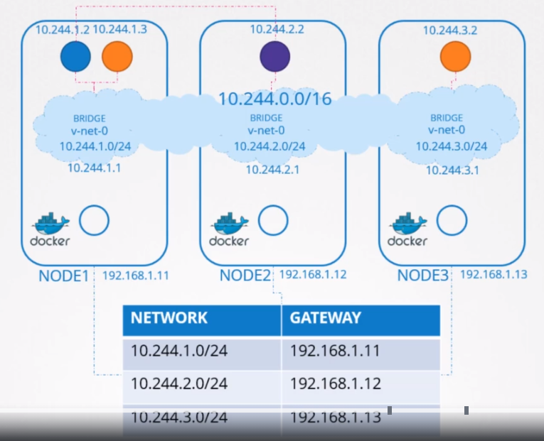
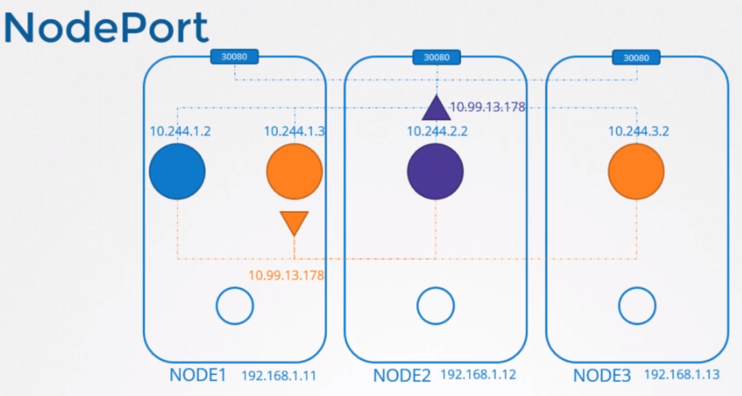
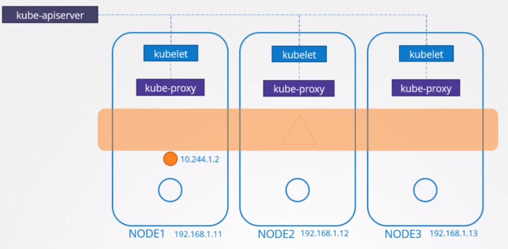
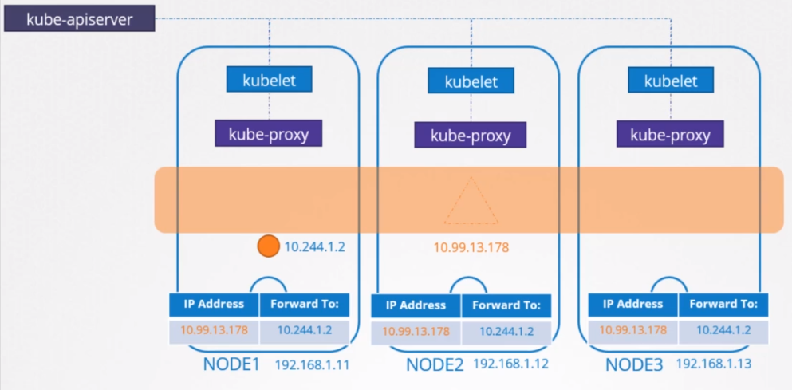

# Service Networking
이전 강의에서 POD 네트워킹에 대해서 알아보았다.


어떻게 각 노드에서 브릿지 네트워크가 생성되고 PODS가 네임스페이스를 어떻게 가지는지 그리고 인터페이스들이 어떻게 네임스페이스에 붙는지 알아봤다.

그리고 POD가 node에 할당된 subnet에서 어떻게 IP 주소를 할당 받는지에 대해 알아보았다.

그리고 노드 전반적으로 pod들이 통신할 수 있는 거대한 가상 네트워크를 구성하는 것도 알아보았다.

이제 포드가 서로 직접 통신하도록 구성하지는 않는다.

POD가 다른 POD에서 호스팅 되는 서비스에 액세스하도록 하려면 항상 서비스를 사용한다.

## ClusterIP (Service)
서비스가 생성되면 머느 노드에 있는 POD인지 상관없이 모든 클러스터에 액세스할 수 있다.

POD가 노드에 호스팅되면 서비스는 클러스터 전반으로 호스팅된다. 특정 노드에 바인딩되지 않는다.

하지만 기억할 점은 서비스는 오직 클러스터 내부에서만 접근가능하다.

이러한 타입의 서비스를 **ClusterIP**라고 한다.

내부에서 운영할 DB 서비스 운영에 적합하다.

## NodePort (Service)
만약 클러스터 외부에서 접속가능한 웹 어플레케이션을 호스팅 하는 파드가 있다고하자.

이 경우 NodePort라는 타입의 서비스를 생성한다.

이 서비스는 IP 주소를 할당받고 ClusterIP처럼 동작한다. 할당된 IP를 통해 모든 POD에서 이 서비스에 접근 가능하다.

하지만 추가적으로 클러스터의 모든 노드에 있는 포트에서 어플리케이션을 노출 시킨다.

이러한 방법으로 외부 유저 또는 어플리케이션이 이 서비스로 접근을 할 수 있다.


## 다뤄볼 주제
* 어떻게 서비스가 IP 주소를 얻으며 어떻게 모든 클러스터들에 있는 노드를걸쳐 사용이 가능할까??
* 서비스는 각 노드의 포트를 통해서 외부 유저들의 어떻게 접근을 하게 할까?
* 무엇이 그리고 어떻게 어디서 이것을 할까?


우리는 모든 노드에서 pod 생성을 관리하는 kubelet이 동작하는 것을 안다. 각 노드에 있는 각 kubelet 서비스는 kube-api서버를 통해서 클러스터에서 발생하는 변화에 대해서 추적한다.

새로운 POD가 생성하려고 할 때마다, 노드에 POD를 생성한다.

이 때 POD의 네트워크 설정을 위하여 CNI 플러그인을 동작 시킨다.

비슷하게 각 노드는 kube-proxy라고 불리는 다른 컴포넌트를 동작시킨다.

kube proxy는 kube-api서버를 통해서 클러스터 내부에서의 변화를 추적한다.

그리고 매번 새로운 서비스가 생성되면, kube-proxy는 작동한다.

POD와 다르게 서비스는 어느 노드에 할당되거나 각 노드에 모두 생성되지않는다.

서비스는 클러스터 범위의 계념이다.

클러스터의 모든 노드에 전반적으로 존재한다.

사실 그들은 전혀 존재하지 않는다. 실제로 서비스의 IP를 수신하는 서버나 서비스가 없다.

우리가 봐왔던 대로 POD는 컨테이너를 가지고 있고 컨테이너는 인터페이스와 함께 네임스페이스를 가지고 해당 인터페이스에 할당된 IP가 있다.

서비스는 위 같이 존재하지안는다.

서비스를 위한 프로세스 또는 네임스페이스 또는 인터페이스는 존재하지않는다.

이것은 그저 가상 객체이다. 그럼 어떻게 IP 주소를 가지게 되고 서비스를 통해서 어떻게 pod에 있는 어플리케이션에 접근할 수 있을까?


쿠버네티스에 서비스 객체를 생성하면 pre-defined된 범위에서 ip 주소를 할당 받는다.

kube-proxy 컴포넌트는 각 노드에서 동작하고 있고, IP 주소를 가져와 클러스터 내부에 있는 각 노드에 포워딩 규칙을 만든다. 

이 IP ( 서비스의 IP )로 들어오는 모든 트래픽은 클러스터의 각 POD의 IP로 가게된다.

이러한 것이 한번 위치하면, POD가 서비스의 IP에 도달하려고 할 때마다 클러스터의 모든 노드에서 액세스할 수 있는 POD IP 주소로 전달된다.

기억할 것은 이것은 IP뿐만아니라 IP와 port 조합이다.

서비스가 생성되거나 삭제될때마다 kube-proxy 컴포넌트는 이러한 규칙을 삭제한다.

그럼 어떻게 이러한 규칙이 생성될까??

kube-proxy는 다양한 방법으로 이를 제공한다.
* userspace - Listens on a port for each service and proxies connections to the pods.
* ipvs
* iptables ( default )

설정 방법 ( 설정하지 않으면 iptables가 기본값 )
```
kube-proxy --proxy-mode [userspace | iptables | ipvs ]
```

iptables가 kube-proxy로 인해 어떻게 설정되는지에 대해서 알아보고 node에서 어떻게 확인하는지 알아본다.

node-1에 배포된 db라는 이름의 pod가 있다.

이 pod는 10.244.1.2 IP주소를 가졌다. ClusterIP타입의 서비스로 이 pod를 생성하고 클러스터에서 이를 사용할 수 있다.

```
$ kubelet get pods -o wide

$ kubelet get service
```
서비스가 생성되면 쿠버네티스는 서비스에 IP를 할당한다.

여기서는 10.103.132.104를 할당 했다. 이 범위는 kube-apiserver에서 service-cluster-ip-range 옵션으로 지정된다.
```
kube-api-server --service-cluster-ip-range ipNet (Default: 10.0.0.0/24 )

$ ps aux | grpe kube-api-server
 
```
pod 네트워크를 설정할 때, 10.244.0.0/16의 POD 네트워크의 CIDR 범위를 제공한다. 이는 POD에 10.244.0.0 에서 10.244.255.255 범위의 주소를 할당시켜준다.

여기서 이것을 가져온 이유는 이러한 각 네트워크에 대해 지정된 범위가 이 겨우엔느 겹치지 않아야 하기 때문이다.

모든 경우에서 IP의 범위를 지정해만 한다. POD와 서비스에 동일한 IP 주소가 할당되어서는 안된다.

## Service가 IP 주소를 얻는 방법
iptables의 NAT table out에서 kube-proxy에 의해서 룰이 추가되는 것을 볼 수 있다.
```
$ kubelet get service
NAME        TYPE        CLUSTER-IP      PORT(S)     AGE
db-service  ClusterIP   10.103.132.104  3306/TCP    12h
## kube-proxy로 생성된 모든 룰 보기
$ iptables -L -t net | grep db-service
KUBE-SVC-XA3    tcp --  anywhere    10.103.132.104  /*  default/db-service: cluster IP */ tcp dpt:3306
DNAT            tcp --  anywhere    anywhere        /*  default/db-service: */  tcp to:10.244.1.2:3306
```

위 설정은 10.103.132.104의 3306포트로 들어오는 모든 접속을 10.244.1.2:3306으로 보내준다는 뜻이다

이것이 iptables의 DNAT 설정에 들어간다.

비슷하게 NodePort로 설정해도 kube-proxy는 iptables 룰을 생성하고 특정 포드로 들어오는 모든 트래픽을 각각의 백엔드 팟으로 넘겨준다.

log에서 내용을 확인할 수 있다.
```
cat /var/log/kube-proxy.log
```
