# Ingress
Service VS Ingress

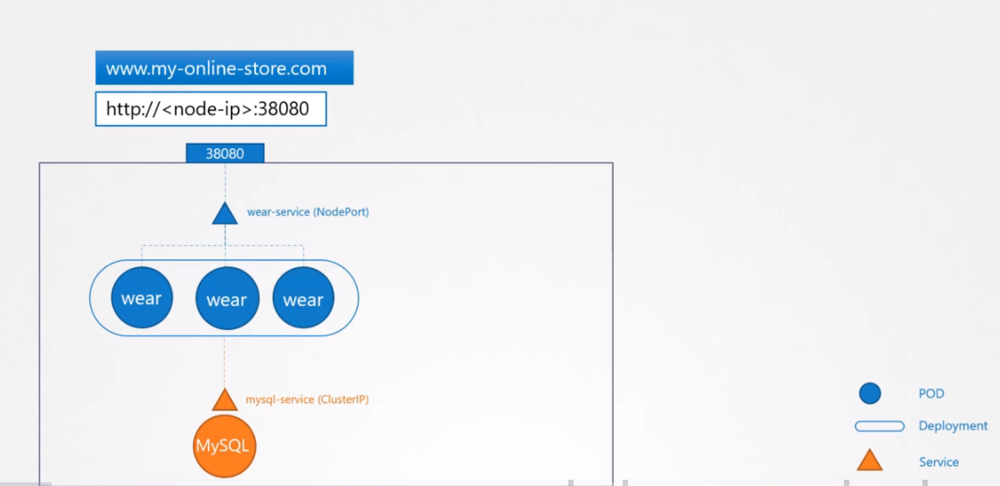
위 같은 서비스가 있다고 가정하자.

* wear 이라는 pod가 있다고하고, POD가 사용하는 DB (MySQL)이 외부에 노출이 되지않는 ClusterIP로 서비스를 생성한다.
* 유저들이 어플리케이션에 접근하기위해서 38080 포트를 통해 외부와 통신 한다 (NodePort)
* 유저들은 http:// IP 를통해서 어플리케이션에 접근가능하다.


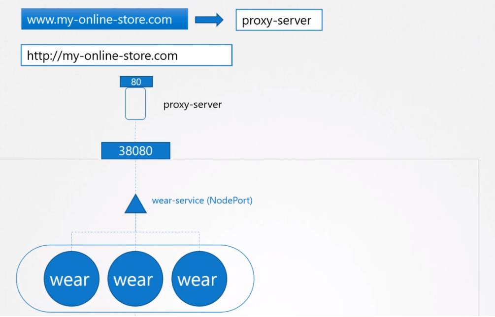 
* 만약, 외부로 node의 IP를 노출하고 싶지않는다면 DNS를 사용한다
* 포트를 노출하고 싶지않는다면 proxy 서버를 앞에 두고, DNS가 proxy서버를 바라보고 80포트를 통해서 접근하게 한다.

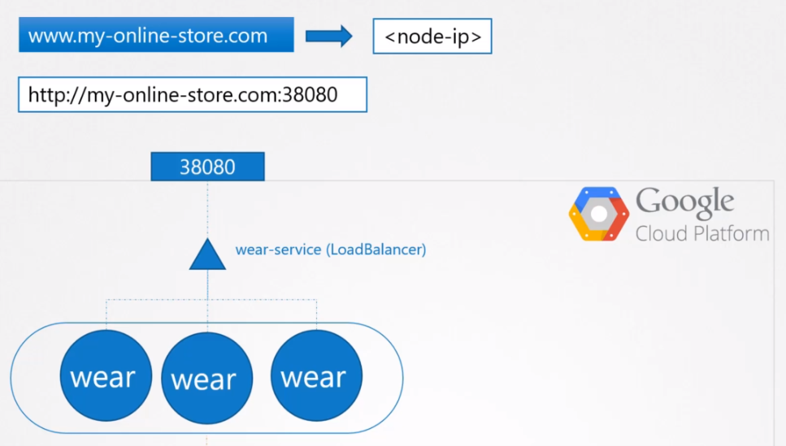
* GCP와 같은 public cloud environment에서 운영한다면, NodePort를 사용하지않고 LoadBalancer를 사용한다.
* LoadBalancer은 NodePort가 해야할 일을 동일하게 수행한다.
    * 서비스를 위한 높은 포트를 프로비져닝한다.
* 그러나 추가적으로 쿠버네티스도 GCP에 서비스를 위한 네트워크 로드 밸런서를 프로비저닝하게 요청한다.

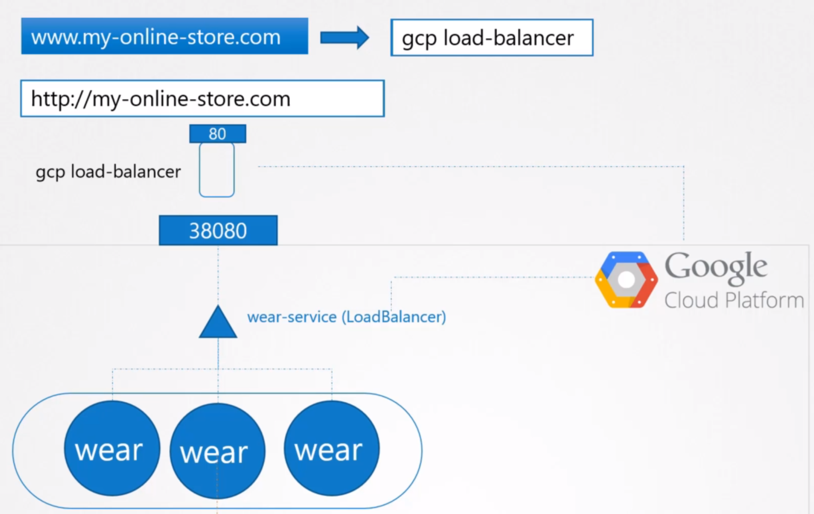
* GCP가 요청을 받으면 자동으로 모드 노드에 대한 서비스 포트에 트래픽을 라우트하게 로드 밸런서를 설정하고 이 정보를 쿠버네티스에 반환해준다.
* 로그 밸런서는 유저가 어플리케이션으로 접근할 수 있는 외부 IP를 제공한다.

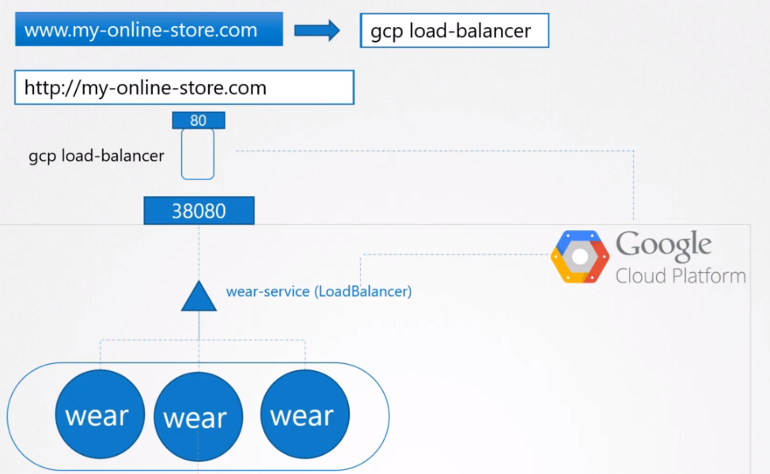
* 이 경우 DNS가 로드밸런서를 바라보고 있고 유저들은 URL (my-online-store.com)을 통해서 어플리케이션에 접근 가능하다.

* 회사가 커져서 다른 서비스도 운영하기 시작했다고 가정한다.
* 완전히 다른 새로운 어플리케이션을 만들었고, 예전의 어플리케이션은 /wear를 통해 접근하게 한다.
    * www.my-online-store.com/wear
    * www.my-online-store.com/watch

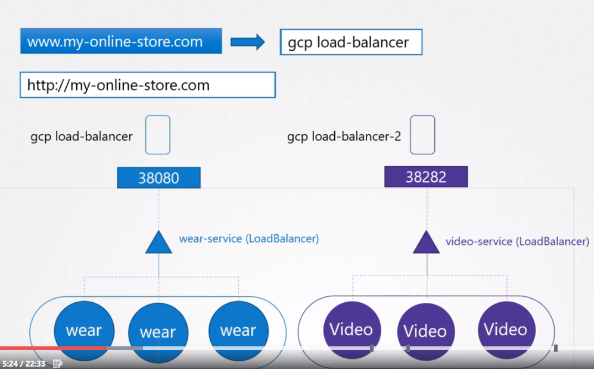
* 하지만 같은 클러스터 자원을 공유하려면 새로운 어플리케션을 분리된 디플로이먼트로 같은 클러스터에 배포해야한다.
* 하지만 이렇게 로드밸런서를 사용하면 각 로드밸러서마다 각자 비용이 청구된다.

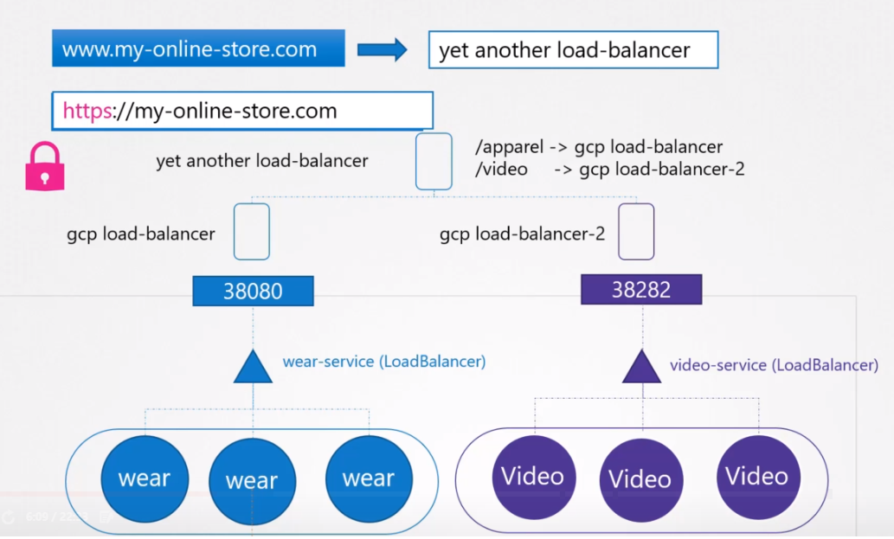
* URL을 기반으로 트래픽을 다른 서비스로 보내는 로드 밸런서를 사용한다.
* 하지만 최소한의 관리 요소를 유지하기위해서 하나로 보안, 접근 제어등을 할 필요가 있다.

## Ingress의 시작
Ingress는 유저의 어플리케이션 접근에 도움을 주기위해서 나타났다.

URL path를 기반으로 하나의 외부 접근 가능한 URL로 클러스터 내부의 다른 서비스들에 라우트할 수 있는 설정이 가능하다. 그와 동시에 SSL 설정도 가능하다.

Ingress의 생각은 native 쿠버네티스 primitives를 사용하여 설정되는 쿠버네티스 클러스터에 빌트인된 7계층의 로드 밸런서이다.

기억할 점은 Ingress를 사용하더라도 노출이 필요하다.

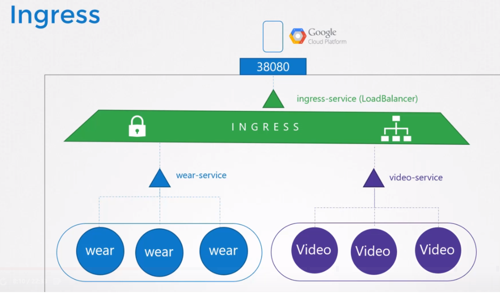
클러스터 외부에서 접근가능하게 만들려면 cloud native load balancer 또는 nodePort로 이를 공표해야한다.

하지만 이는 한번만 설정해주면된다.

앞으로 모든 부하 분산, 인증, SSL 및 URL 기반은 Ingress 컨트롤러의 라우팅 구성이 수행하게 된다.

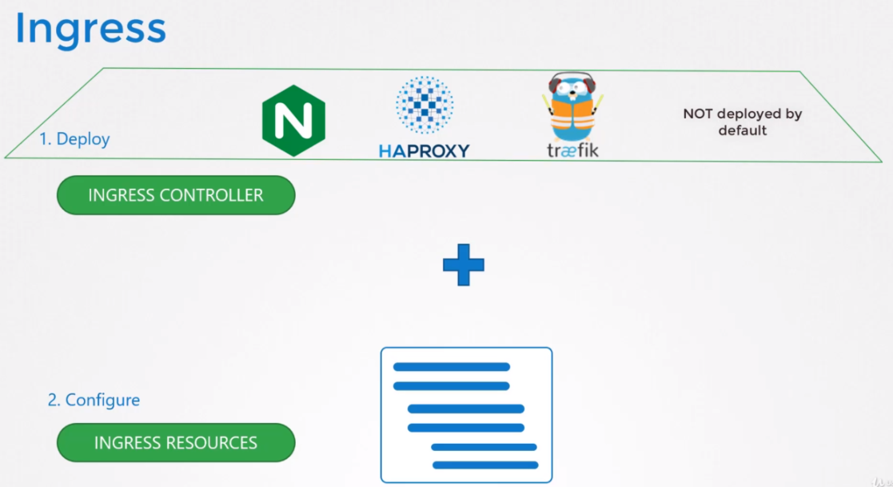

Ingress가 없이 이러한 것은 어떻게 설정할까?

아마 reverse-proxy 또는 NGINX 또는 HAProxy 또는 Traefik과 같은 로드 밸런싱 솔루션을 사용할 것이다.

여기서 이것들을 kubernetes 클러스터에 배포하고 다른 서비스로 트래픽을 라우트하는 것으로 설정을 한다.

그 설정에는 URL 라우트에 대한 정의, SSL 자격 증명 등이 포함 된다.

Ingres는 쿠버네티스로부터 같은 방식으로 구현된다.

먼저 지원하는 솔루션을 배포하고, 여기에 나열된 다음 수신을 구성할 규칙 집합을 지정한다.

배포한 솔루션은 **Ingress controller**라고 불리고 설정값이 설정한 규칙들을 **Ingress resources**라고 부른다. 


기억할 점은 쿠버네티스 클러스터에는 기본 Ingress Controller가 없다.

## Ingress Controller
ingress로 사용가능한 다양한 솔루션들이 있다. 
* Google Layer 7 HTTP Load Balancer
* NGINX, Contour, HAProxy, Traefik, Istio

쿠버네티스 프로젝트에서는 GCE와 NGIX를 최근에 지원하고 유지보수해주고 있다.

여기서는 NGINX를 사용해서 예를 들기로 한다.

이 Ingress Controller는 다른 로드밸런서나 nginx server와는 다르다. 로드 밸런서 컴포넌트는 이것의 일부이다.

Ingress Controller는 새로운 정의 또는 Ingress resource에 대한 쿠버네티스 클러스터를 모니터링하고 그에 따라 nginx 서버를 구성하는 추가 인텔리전스가 내장되어 있다.

Nginx controller는 쿠버네티스에 다른 디플로이 먼트로 배포된다.

### 예시 파일 - Ingress controller
nginx-ingress-controller : [nginx-ingress-controller.yaml](../demo/ingress/nginx-ingress-controller.yaml)  
SSL, log 등 nginx 설정 파일 (configMap) : [nginx-configuration](../demo/ingress/nginx-configuration.yaml)  

따라서 nginx-ingress 레이블 선택기로 NodePort 유형의 서비스를 만들어 서비스를 디플로이먼트에 연결한다.  
service에서 디플로이먼트로 연결 (Service) : [nginx-ingress](../demo/ingress/nginx-ingress.yaml)

직전에 말했듯이, ingress controller는 추가적인 빌트인 지능이 있다. ingress resource에 대한 쿠버네티스 클러스터 모니터링을 한다.

Role Binding: [roles](../demo/ingress/ingress-roles.yaml)

요약 

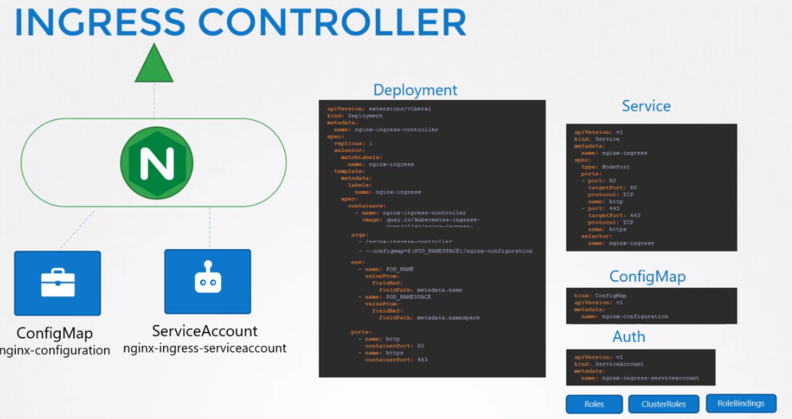 

이로서 Ingress controller 설정은 완료 되었으며, 이제 ingress resource를 생성하고 ingress controller에 룰과 설정을 설정하는 방법에 대해서 알아본다.

### 예시 파일 - Ingress resources
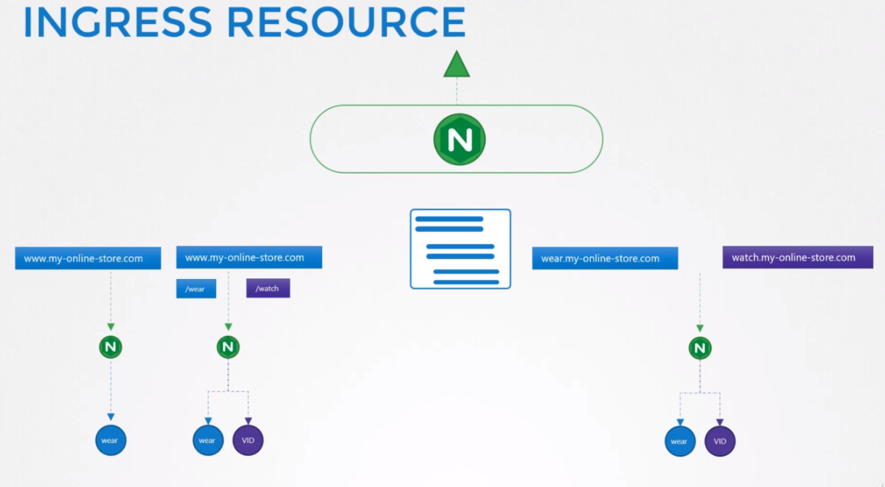

* www.my-online-store.com/wear, /watch 형식의 URL
* wear.my-online-store.com, wathc.my-online-store.com 형식의 URL

1. www.my-online-store.com
이 경우 [ingress-wear.yaml](../demo/ingress/ingress-wear.yaml)이다.  
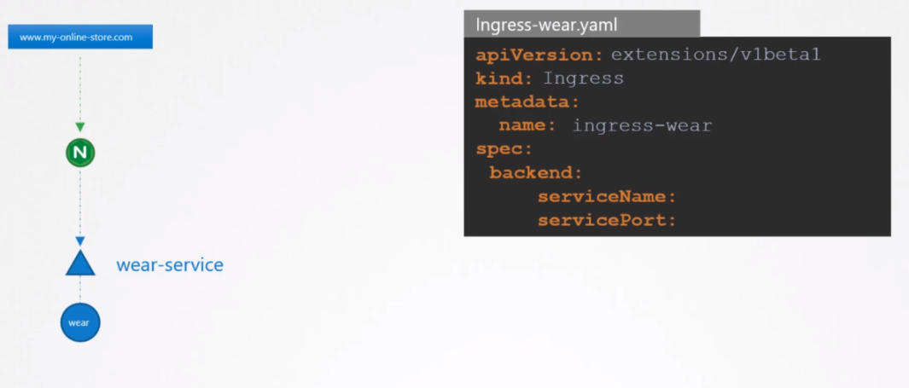

단일 서비스일 경우 하나의 backend 서비스만 지정해 주면 된다.
```
kubectl create -f ingress-wear.yaml

kubectl get ingress
```

새로운 ingress가 추가되었으며 모든 트래픽은 이제 wear-service로 흐르게 된다.

다른 조건으로 트래픽을 라우팅 하려면 rules를 사용한다.

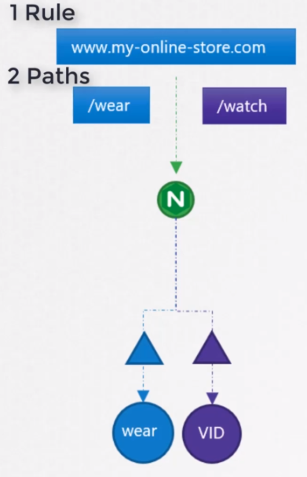  
[ingress-wear-watch](../demo/ingress/ingress-wear-watch.yaml)

```
kubectl describe ingress ingress-wear-watch
``` 
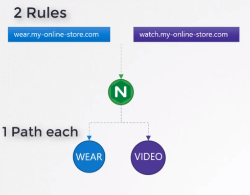

host field에 추가

host field가 만약 설정되어있지 않다면, 호스트 이름과 일치하지 않고 특정 규칙을 통해 들어오는 모든 트래픽을 수락한다.
  
[ingress-wear-watch](../demo/ingress/ingress-wear-wath_subdomain.yaml)
