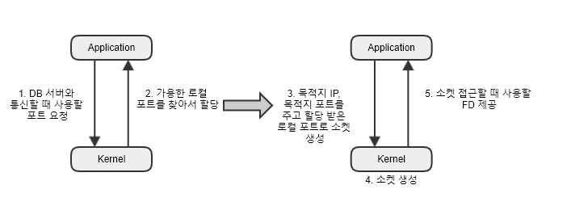
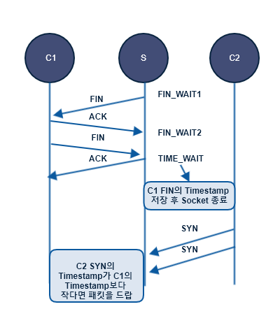
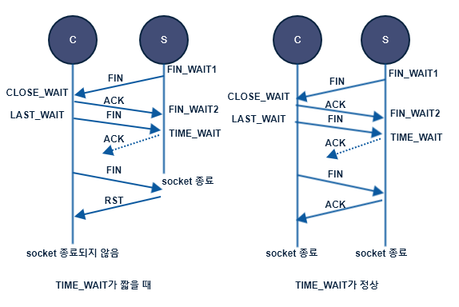

# TIME_WAIT 소켓이 서비스에 미치는 영향
TIME_WAIT 상태가 무엇을 의미하고 왜 발생하는지, 그리고 서비스에는 어떤 영향을 끼칠 수 있는지 살펴봄
## 7.1 TCP 통신 과정
TCP 통신 과정을 살펴본다.

통신을 시작하기 전에 최초의 연결을 맺게 되는 과정을 3-way handshake라고 한다.  
클라이언트는 서버로 통신을 시작하겠다는 SYN을 보내고, 서버는 그에 대한 응답으로 SYN+ACK를 보낸다.  
마지막으로 클라이언트는 서버로부터 받은 패킷에 대한 응답으로 ACK를 보낸다.  
이렇게 3-way handshake를 정상적으로 마친 다음 클라이언트는 서버에 데이터를 요청한다.  
HTTP 통신일 경우 GET /index.html과 같이 요청하고, 통신을 모두 마친 후에는 연결을 종료한다.  
이 과정을 4-way handshake라고 한다.


연결을 맺을 때는 연결을 맺고자 하는 쪽에서 먼저 SYN을 보내며, 연결을 끊을 때는 연결을 끊으려는 쪽에서 먼저 FIN을 보낸다.  
위 그림에서는 서버가 먼저 연결을 끊었다. 클라이언트는 ACK를 보내고 사용한 소켓을 정리한 다음 마지막 FIN을 보낸다.  
서버는 클라이언트가 보낸 마지막 FIN에 대한 ACK를 전송하고 소켓을 정리한다.  

`서버에서 tcpdump 명령을 통해 덤프 파일 생성하기`
생성된 결과는 wireshark를 사용하여 확인할 수 있다.
```
$ sudo tcpdump -A -vvv -nn port 80 -w server_dump.pcap
```

## TIME_WAIT 소켓의 문제점
연결을 끊는 과정을 살펴보면 active closer와 passive closer가 있다.
* active closer : 연결을 먼저 끊는 곳
* passive closer : 그 반대
누가 먼저 연결을 끊느냐가 중요한 이유는 active closer 쪽에 TIME_WAIT 소켓이 생성되기 때문이다.  
주의해야 할 부분은 TIME_WAIT 소켓은 서버에서 생기는 것이 아니고 먼저 연결을 끊는 쪽에서 생성된다.  
클라이언트에서도 TIME_WAIT 소켓이 생길 수 있고, 서버에서도 TIME_WAIT 소켓이 생길 수 있다.  


`서버에서 TIME_WAIT 소켓이 몇 개나 있는지 알아 보는 방법`
```
$ netstat -napo | grep -i time_wait
tcp 0 0 172.16.33.136:32002 172.17.246.27:6379 TIME_WAIT timewait (21.45/0/0)
``` 

명령 결과 해석
소켓 정보
* 출발지 IP : 172.16.33.136 , 포트 : 32002
* 도착지 IP : 172.17.246.27 , 포트 : 6379
* 상태 : TIME_WAIT 상태이기 때문에 타이머가 종료되어 커널로 다시 돌아갈 때까지는 사용할 수 없다.

이처럼 TIME_WAIT 소켓이 많아지면 생길 수 있는 문제점
* 로컬 포트 고갈에 따른 애플리케이션 타임 아웃이 발생할 수 있다.  
`net.ipv4.ip_local_port_range` : 외부와 통신하기 위해 필요한 로컬 포트의 범위를 지정하는 커널 파라미터

```
$ sysctl -a | grep ipv4.ip_local_port_range
net.ipv4.ip_local_port_range = 32768    60999
```
커널은 프로세스가 외부와 통신하기 위해 소켓의 생성을 요청할 때 해당 소켓이 사용하게 될 로컬 포트에 net.ipv4.ip_local_port_range에 정의된 값들 중 하나를 넘겨줌  
이때 모든 로컬 포트가 TIME_WAIT 상태에 있다면 할당할 수 있는 로컬 포트가 없기 때문에 외부와 통신을 하지 못하게 되고, 이로 인해 애플리케이션에는 타임아웃이 발생할 수 있다.

* 잦은 TCP 연결 맺기 / 끊기로 인해 서비스 응답 속도 저하
불필요한 TCP 3-way handshake를 줄이는 것은 성능 향상에 도움이 됨 => Connection pool 같은 걸 사용

## 클라이언트에서의 TIME_WAIT
> TIME_WAIT은 서버에 생기는 것이 아니라 먼저 연결을 끊는 쪽에서 생긴다.

HTTP 기반의 서비스는 대부분 서버가 먼저 연결을 끊는 경우가 많기 때문에 서버에서 TIME_WAIT가 생긴다고 오해할 수 있지만 그렇지 않음  

서버들이 데이터베이스, 메모리 기반의 캐시 시스템과 연동하거나 외부 서비스와 연동할 경우, 서버도 클라이언트가 된다.  
클라이언트 입장에서 TIME_WAIT가 발생했을 때 가장 큰 문제는 로컬 포트가 고갈되는 것이다. 클라이언트는 요청을 보내기 위해 소켓을 만드는데, 이 때 가용한 로컬 포트 중 하나를 임의로 배정 받아서 나가게 됨



|출발지 IP|자신의 IP|
|출발지 PORT|(ex.35010)|
|도착지 IP|DB서버 IP|
|도착지 PORT|(ex.3306)|

과정
1. Application은 DB 서버와 통신을 위해 커널에 소켓 생성 요청
2. 커널은 관리중인 로컬 포트 목록 중에 사용할 수 있는 포트 번호 한개 할당
3. Application은 할당 받은 번호로 커널에 소켓 생성 요청
4. 커널은 해당 정보로 소켓 생성. 출발지 ip,port, 도착지 ip,port 4가지는 하나의 쌍으로 커널 내부에 **유일**하게 존재한다.
5. 소켓 생성이 정상적으로 완료되면 커널은 Application에서 소켓 접근에 사용할 FD(File Descriptor)를 전달

이렇게 사용된 소켓을 active close하게 되면 TIME_WAIT 상태로 남는다.  
그렇기 때문에 정상적인 상황이라면 해당 소켓은 TIME_WAIT 상태가 풀려서 커널로 다시 돌아갈 때까지 다시 사용할 수 없다.  

외부로의 요청에 TIME_WAIT 소켓이 쌓이면 더 이상 할당할 수 있는 로컬 포트가 없어서 사용자의 요청을 처리할 수 없게 된다.
## net.ipv4.tcp_tw_reuse
로컬 포트 고갈에 대응할 수 있는 방법 중 하나로 커널 파라미터 사용  
net.ipv4.tcp_tw_reuse는 외부로 요청할 때 TIME_WAIT 소켓을 재사용할 수 있게 해준다.  
```
$ sudo sysctl -w "net.ipv4.tcp_tw_reuse=1"
```
**net.ipv4.tcp_tw_reuse**는 timestamp 기능과 함께 사용해야 하고,  
**net.ipv4.tcp_timestamps** 값이 반드시 1이어야 한다.

## ConnectionPool 방식 사용하기
근본적인 문제 해결  
TIME_WAIT 소켓이 쌓이는 문제는 active_close 때문이다. 연결을 끊고, 다시 연결하는 리소스 낭비를 줄여야한다.  
Connection pool 방식으로 미리 소켓을 열어놓고 요청을 처리
미리 열어놓기 때문에 불필요한 TCP 연결 맺기 / 끊기 과정이 없어서 더 좋은 애플리케이션 응답 속도를 구현  

## 서버 입장에서의 TIME_WAIT 소켓
서버 입장에서는 클라이언트 상황과는 조금 다르다.  
서버는 소켓을 열어 놓고 요청을 받아들이는 입장이기 때문에 로컬 포트 고갈과 같은 문제는 일어나지 않는다.  
하지만 클라이언트와 마찬가지로 다수의 TIME_WAIT 소켓이 있으면 불필요한 연결 맺기 / 끊기의 과정이 반복된다.  

> test 방법
> nginx를 설치하고, keepalive_timeout을 0으로 설정
> 요청을하고, ```$ netstat -napo | grep -i :80```

## net.ipv4.tcp_tw_recycle
net.ipv4.tcp_tw_reuse vs net.ipv4.tcp_tw_recycle  
* net.ipv4.tcp_tw_reuse : 나갈 때 사용하는 로컬 포트에서 TIME_WAIT 상태의 소켓을 재사용할 수 있게 해주는 파라미터
* net.ipv4.tcp_tw_recycle : 서버 입장에서 TIME_WAIT 상태의 소켓을 빠르게 회수하고 재활용할 수 있게 해주는 파라미터

동작 로직
1. 가장 마지막에 해당 소켓으로부터 들어온 timestamp 저장
2. TIME_WAIT 소켓의 타이머를 RTO (retransmission timeout) 기반의 값으로 변경
TIME_WAIT 소켓의 기본 타임아웃은 1분이다.  

**하지만** 웹 서버에서는 문제가 발생할 수 있기 때문에 **절대로 tw_recycle을 켜서는 안된다**
tcp_tw_recycle은 매우 빠르게 정리되지만, NAT환경이나  load-balancers, 방화벽 같은 환경에서 너무 빨리 재활용되어 오히려 문제가 발생할 수도 있다  


상세 내용
> Client 1, 2가 같은 통신사를 사용할 경우 동일한 NAT를 사용할 수 있고 S 입장에서는 같은 목적지 IP를 달고 오기 때문에 같은 클라이언트로 보게 된다.  
> 서버는 Client1과의 통신을 잘 마무리하고 로직상에 구현되어있는 대로 TIME_WAIT  소켓을 RTO 값으로 세팅해서 금방 정리하고, Client1의 Timestamp를 저장한다.  
> 그 후 Client 2가 다시 한번 연결 오픈 요청을 보내면, 이떄 Client 1과 Client2는 동일한 클라이언트가 아니기 떄문에 시간이 살짝 다를 수 있으며, 이때 Timestamp 값이 C1이 보낸 FIN에 기록된 timestamp 보다 작을 수 있다.  
> 서버 입장에서는 동일한 IP를 가진 목적지에서 기존보다 더 작은 Timestamp를 가지고 통신 연결을 요청하기 때문에 잘못된 연결 요청으로 판단하고 패킷을 처리하지 않고 버린다.
> 하지만 Client2는 패킷이 버려진 것을 모르고 재전송한다.  
> 자신이 보낸 SYN에 대한 응답이 오지 않았기 때문이다.
> 이렇게 연결은 되지 않고 연결 요청만 계속해서 일어나게 되는 현상이 클라이언트의 요청을 직접 받는 웹 서버에서 주로 발생할 수 있기 때문에 웹 서버에서는 절대로 tw_recycle을 켜서는 안된다.

## keepalive 사용하기
keepalive는 한번 맺은 세션을 요청이 끝나더라도 유지해주는 기능  
불필요한 연결 맺기 / 끊기를 없애면 , TPS가 높아질수록 성능이 좋아진다.  

nginx의 nginx.conf에서 설정 수정
```
keepalive_timeout 10;
```
timeout이 10으로 설정되면 10초 후에 서버에서 먼저 연결을 끊게된다.  
서버 입장에서 keepalive를 켜서 세션을 유지해주면 TIME_WAIT 소켓을 줄일 수 있으며, 불필요한 TCP 연결 맺기 /끊기 과정이 사리지기 때문에 서비스의 응답 속도도 더 향상시킬 수 있다.

## TIME_WAIT 상태의 존재 이유
지금까지 살펴본 내용만 보면 TIME_WAIT은 좋지 않은 소켓의 상태이고 없애야 할 것처럼 보인다.  
하지만, TCP 통신 과정에서 TIME_WAIT 소켓은 반드시 필요하다.  


TIME_WAIT 상태가 매우 짧을 경우, 비정상적인 통신 흐름에 대응을 하지 못한다.  
위 예에서 보면, 마지막 ACK가 유실되어 C에서는 자신이 보낸 FIN에 대한 ACK를 받지 못한 상황이다.  
C의 입장에서는 ACK를 받지 못했기 때문에 FIN을 다시 한번 보내게 되지만, S의 입장에서는 이미 TIME_WAIT 상태의 소켓을 정리해 버렸기 때문에 C로부터 받은 FIN이 정상적인 FIN이라 판단하지 않고 RST (reset)을 보낸다.  
C는 자신이 정리해야 하는 소켓에 대해 계속해서 정상적인 ACK를 받지 못하기 때문에 소켓이 LAST_ACK 상태로 계속해서 남아있게 된다. 그래서 비정상적으로 LAST_ACK상태의 소켓이 점점 증가한다.  

반면 TIME_WAIT가 정상적일 경우, S의 ACK가 유실되더라고 하더라도 C의 재전송된 FIN을 처리할 만한 충분한 시간 동안 소켓이 TIME_WAIT 상태로 살아있기 때문에 자신이 ACK를 보냈다고 하더라도 무언가 통신에 이상이 생겼음을 감지하고 C의 FIN에 대해 한번 더 ACK를 보낸다.  
  

