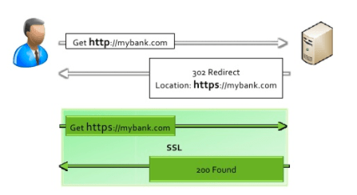
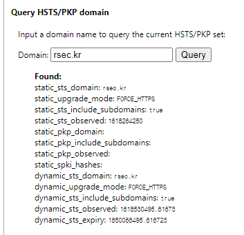
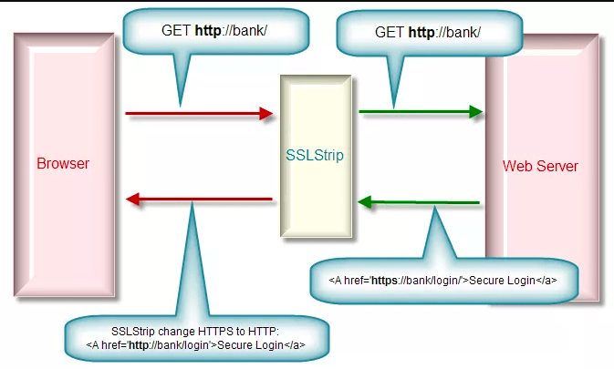

# HSTS (HTTP Strict Transport Security)
HTTPS 프로토콜의 여러가지 옵션과 개념들중 HSTS에 대해서 알아본다.

## HSTS (HTTP Strict Transport Security) 란?
일반적으로 HTTPS를 강제하게 될 때 서버측에서 302 Redirect 를 이용하여 전환시켜 줄 수 있다. 하지만 이것이 취약점으로 작용될 수 있다.

참고 : https://rsec.kr/?p=315  


그리하여 클라이언트 ( 브라우저 )에게 HTTPS를 강제하도록 하는 것이 권장되는데, 이것이 HSTS (HTTP Strict Transport Security)이다.

클라이언트 ( 브라우저 )에서 강제하기 때문에 Plain Text (HTTP)를 이용한 연결 자체가 최초부터 시작되지 않으며 클라이언트 측에서 차단된다는 장점이 있다.


사용자가 최초로 사이트에 접속시도를 하게 되면 웹서버는 HSTS 설정에 대한 정보를 브라우저에게 응답하게 된다. 브라우저는 이 응답을 근거로 일정시간동안 HSTS 응답을 받은 웹사이트에 대해서 https 접속을 강제한다.

이렇게 설정된 HSTS 내역은 클라이언트의 브라우저에서 확인할 수 있는데, 크롬 브라우저의 경우는 아래와 같은 명령어로 확인 가능하다.

```
chrome://net-internals/#hsts
```



HSTS는 이렇게 서버측 응답을 신뢰하여 브라우저에 일정시간 (max-age)동안 등록이 되기도 하지만, google, twitter 등의 웹사이트는 구글 크롬 브라우저에 하드코딩 되어 HSTS가 Preload되어 강제화 되도록 되어 있다.

```
https://www.chromium.org/hsts
```

## HSTS 설정 방법

HSTS는 웹서버에서 응답해주는 헤더에 최초 포함되어 있는 만큼 웹서버에서 설정해주어야 한다. Nginx의 경우는 아래와 같이 add_header를 추한 후 재시작하면 HSTS를 적용할 수 이싿.

```
add_header Strict-Transport-Security "max-age=63072000; includeSubdomains; preload";
```

옵션 내용
* max-age=63072000 : HSTS가 브라우저에 설정될 시간이며 초단위로 설정된다. 63072000은 2년을 의미
* includeSubdomains : HSTS가 적용될 도메인의 subdomain 까지 HSTS를 확장 적용
* preload : HSTS 적용이 클라이언트 측에서 preload로 이루어짐을 의미

## 확인 방법
아래 사이트에서 확인 가능
```
https://hstspreload.org
```

## HSTS을 이용하여 SSL Strip 방어
일반적으로 잘 알려진 MITM (Man in the Middle) 공격을 보안하기 위함입니다. 일반적으로 TLS/SSL로 암호화 된 세션은 중간에서 공격자가 그 내용을 감청하더라도 암호화 되어 있기 때문에 데이터가 보호 될 수 있습니다.

그렇다면 SSL/TLS 로 암호화 된 세션을 강제로 암호화 하지 않은 HTTP 세션으로 유도한다면 어떨까요? 공격자는 중간에서 암호화 되지 않은 데이터를 감청함으로써 그 내용을 알 수 있을 겁니다. 이러한 방식을 SSL Strip 이라고 이야기 합니다.



1. 사용자는 http://bank 로 연결 시도. 공격자는 그 연결을 그대로 웹서버에 전달
2. 웹서버는 https 를 이용하여 연결하도록 응답
3. 공격자는 웹서버의 응답을 조작하여 http로 연결하는 것처럼 사용자에게 응답
4. 사용자는 응답받은 내용을 근거로 http로 연결. 공격자는 내용을 조회 한 후 https로 전환하여 웹서버에 연결을 전달
5. 최종적으로 공격자는 ssl 을 strip하여 중간에서 내용을 감청 할 수 있음

일반적으로 위와 같이 이루어지는 SSL Strip 공격을 HSTS로 적용하게되면 클라이언트 (브라우저)에서 HTTPS 접속만 강제화 됨으로써 SSL Strip 공격을 방어 할 수 있습니다.
